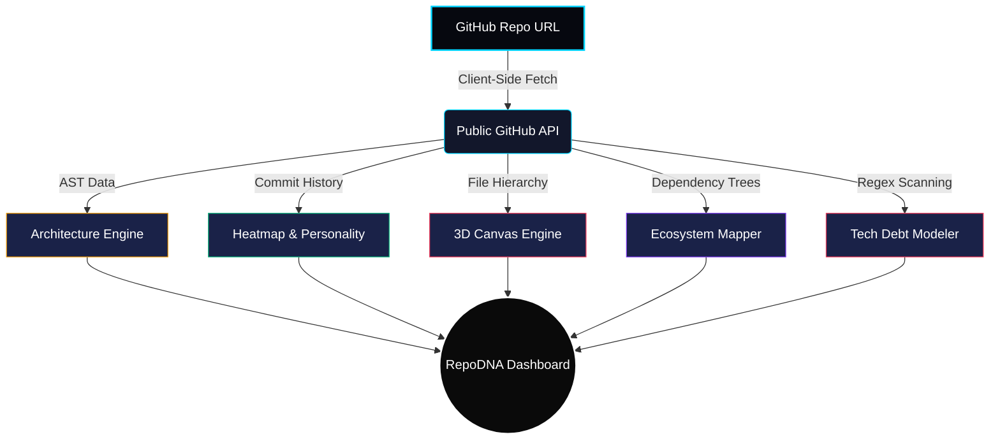

<div align="center">

<p align="center">
  <picture>
    
  </picture>
</p>

**The Definitive Diagnostic Engine for GitHub Repositories.**

<p align="center">
  
  
  
</p>

### Decode the precise architecture, codebase complexity, code ownership, and technical debt of any public repository beautifully—running natively in your browser.

<br/>
</div>

---

## ⚡ What is RepoDNA?

RepoDNA is a hyper-fast, client-side repository analysis engine. It pulls the raw structure, commit timeline, and dependency trees directly from native GitHub endpoints and processes them using **pure parsing algorithms** to generate a visually stunning dashboard. 

Developers love sharing statistics. RepoDNA allows you to generate instantly shareable, vertically-formatted infographic profiles (akin to a "Spotify Wrapped" for developers) that showcase your repository's structural score, code personality, and contributor dynamics.

---

## 🎨 Engine Diagnostics & Metrics

RepoDNA runs an extensive 13-stage diagnostic engine designed to perform a surgical codebase audit.

- 🧠 **Coding Personality:** Dynamically evaluates variance and coding tendencies to assign a developer archetype (e.g., "The Explorer", "The Architect", "The Speedrunner").
- 🏗️ **Architecture Grader:** Issues a definitive grade (A+ to F) evaluating code modularity, documentation depth, and test coverage density.
- 🏙️ **3D Repository City:** An interactive isomorphic 3D HTML5 Canvas rendering of the entire file hierarchy. Height scales to Lines of Code; Color warmth scales to Cyclomatic Complexity.
- 💸 **Technical Debt Timeline:** Scans the entire codebase corpus for lingering markers (`TODO`, `FIXME`, `HACK`) and charts volumetric debt over time.
- 🚌 **Bus Factor Risk Analysis:** Determines exactly how many core developers must step down for the project to critically stall, highlighting dangerously centralized code silos.
- 🌐 **Dependency Ecosystem Map:** Maps structural runtime and native interconnected packages dynamically.
- 🌡️ **Contributor Heatmap:** Evaluates exactly what days and hours your developers are merging commits.

### Analysis Pipeline Architecture



---

## 🛠️ The Architecture 

RepoDNA is built for maximum speed and unparalleled graphical depth.
- **Framework:** React 18 + Vite
- **Typing:** Strict TypeScript
- **Styling:** Pure CSS (Monochrome layout heavily accented by dynamic neon palettes)
- **Data Rendering:** `D3.js` (Heatmaps, Treemaps, Timelines)
- **Engine Capabilities:** HTML5 Canvas (3D Isometric Renderings, and native client-side High-Resolution Image Exporters)

---

## 🚀 Instant Deployment Supported

Because RepoDNA is a 100% static client-side application running immediately over the browser without complex server setups, you can deploy it directly onto any edge provider for free.

### ▶️ Cloudflare Pages (Recommended)
1. Fork this repository to your account.
2. Navigate to **Cloudflare Pages** -> *Connect to Git*.
3. Select your fork.
4. Set the Build Command to: `npm run build`
5. Set the Output Directory to: `dist`

### ▲ Vercel
[](https://vercel.com/deploy)
1. Import your GitHub repository to Vercel.
2. The framework preset (Vite) will be auto-detected successfully.
3. Click **Deploy**.

### 🟩 Netlify
[](https://app.netlify.com/start)
1. Connect GitHub to your Netlify account.
2. Select your repository.
3. Set Build command: `npm run build` | Target directory: `dist`
4. Click **Deploy**.

---

## 💻 Local Sandbox Initialization

To run RepoDNA entirely natively upon your own machine:

```bash
# 1. Clone the repository locally
git clone https://github.com/your-username/repodna.git

# 2. Change your active directory
cd repodna

# 3. Mount module dependencies
npm install

# 4. Spin up the Vite HMR Dev Server
npm run dev
```

The application will be securely mounted and active at `http://localhost:5174/`.

---


